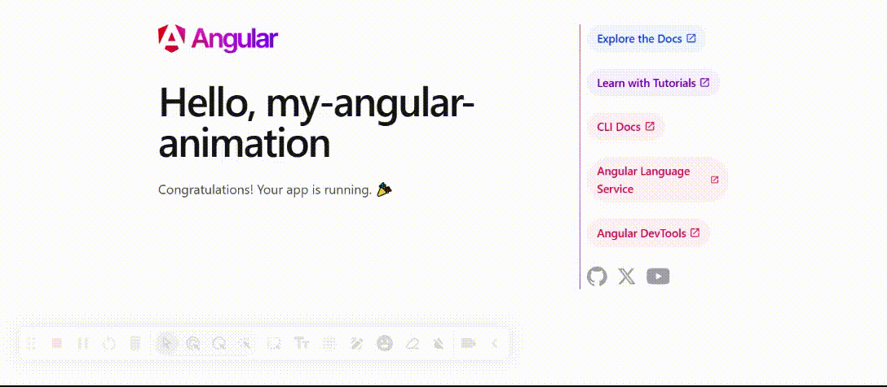

# my-angular-animation library

### Commonly used animations for Angular applications

### Run any custom industry standard animation too

This light-weight Angular library provides a component to create commonly used animations in Angular applications.



## Installation

You can install the library via NPM.
```bash
npm i my-angular-animation
```

## Usage

You can use the provided `animate` component in your Angular components.

The supported animations are:

<table border="0">
 <tr>
    <td>
<ul>
<li>bounce</li>
<li>bounceIn</li>
<li>fadeIn</li>
<li>fadeOut</li>
<li>fadeInOut</li>
<li>fadeOutIn</li>
<li>flip</li>
</ul>
    </td>
    <td>
<ul>
<li>shake</li>
<li>slideUp</li>
<li>slideDown</li>
<li>slideLeft</li>
<li>slideRight</li>
<li>swing</li>
<li>wobble</li>
</ul>
    </td>
 </tr>
</table>

Eg. to animate sliding from right to left, you can use the `animate` component with the `slideLeft` animation.

```html
<animate [id]="animateId" 
         [animation]="animation" 
         [durationInSeconds]="durationInSeconds"
         [iterationCount]="iterationCount"
         (onAnimationTriggered)="animationTriggered()"> 
    <div>my content</div>    
</animate>
```
```typescript
export class AppComponent {
  title = 'my-angular-animation';

  //Animation settings
  animateId = "myAnimation";
  animation = AnimateComponent.slideLeft;
  durationInSeconds = 5;
  iterationCount = 3;

  animationTriggered() {
    console.log("Animation Triggered.")
  }

}
```

You can have any markup inside the `animate` component. The `animate` component will animate the content based on the animation specified.

Set the iterationCount to 1 or more to play the animation only once or more. Default is 1. Set it to 0 to play the animation infinitely.

This animation will fire automatically when the component is rendered.

### Triggering animation

If you want to trigger the animation manually in code, you can set the `isManualTrigger` property to `true`.

And, use a component instance reference (`@ViewChild`) to call the `triggerAnimation` method.

For eg. When the Search button is clicked, `click` event is fired. The `search` event handler method is called which triggers the animation.

```html
<animate [id]="'myAnimation'" 
         [animation]="animation" 
         [durationInSeconds]="5"
         [isManualTrigger]="true"
         #searchResultsAnimation>
    <div>My search results content</div>
</animate>
```
```typescript
export class AppComponent {

  @ViewChild('searchResultsAnimation') searchResultsAnimation;

  search() {
    //Load search data

    this.searchResultsAnimation.triggerAnimation();
  }
}
```

### Triggering animation dynamically

You can use `AnimateSettings` class to set up your animation.

And, call the `triggerAnimationDynamic` method, to run your animation.

```typescript
export class AnimateSettings {
  animation: string = "";
  durationInSeconds?: number = 1;
  delayInSeconds?: number = 2;
  isManualTrigger?: boolean = false;
  iterationCount?: number = 1;
}
```

```typescript
runDynamicAnimation() {
    let settings: AnimateSettings = {
      animation: AnimateComponent.wobble,
      durationInSeconds: 3,
      isManualTrigger: true
    };

    this.searchResultsAnimation.triggerAnimationDynamic(settings);
}
```

### Animate component properties

| Property | Description |
| --- | --- |
| id | Unique identifier for the animation. |
| animation | The animation to apply. |
| durationInSeconds | The duration of the animation in seconds. Default is 1. Accepts fractions. |
| iterationCount | The number of times the animation should play. Default is 1. 0 for infinite. |
| delayInSeconds | The delay (in seconds) before the animation starts. Default is 0. Accepts fractions.|
| onAnimationTriggered | The event is fired after the animation has been triggered. |
| isManualTrigger | Set to true to trigger the animation manually. Default is false. |
| @ViewChild | Component instance reference to call the `triggerAnimation` and `triggerAnimationDynamic` methods. |

## Run any custom industry standard animation

You can also run custom animations using the `animate` component.

Eg. say your custom animation is `slide-right-left`.

Just enter the animation name in the `animation` property.

```html
<animate [id]="'myAnimation'" 
         [animation]="'slide-right-left'" 
         [durationInSeconds]="3"
         [iterationCount]="0">
    <div>My content</div>
</animate>
```

In the above example, the `slide-right-left` animation will be applied to the content inside the `animate` component.

The CSS for the custom animation should be defined in your application's CSS file (eg. styles.css).
```css
/* Custom industry standard animation */

.slide-right-left {
    animation: var(--durationInSeconds) slide-right-left var(--iterationCount) var(--delayInSeconds);
    animation-fill-mode: forwards;
    width: 100%;
}

@keyframes slide-right-left {
    0% {
        margin-left: -100%;
    }

    50% {
        margin-left: 0%;
    }

    100% {
        margin-left: -100%;
    }
}
```

You can use the `--durationInSeconds`, `--iterationCount` and `--delayInSeconds` CSS variables to set the duration, iteration count and delay for the custom animation.

These CSS variables will be set by the `animate` component based on it's `durationInSeconds`, `iterationCount` and `delayInSeconds` properties.